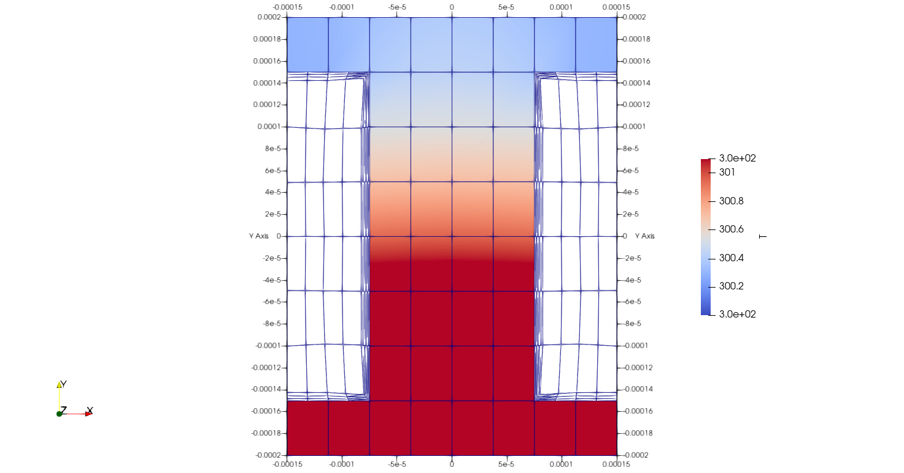
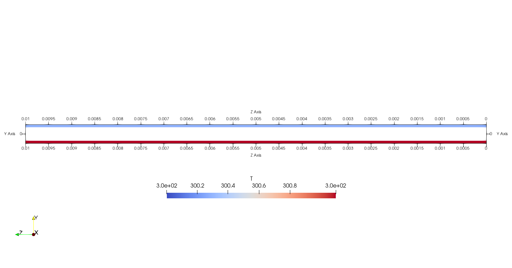

# Simulación térmica de un microcanal

## ¿Qué estamos estudiando?

Este proyecto analiza la transferencia de calor y el cambio de fase agua–vapor dentro de un microcanal. El objetivo es entender cómo un canal de dimensiones micrométricas puede transportar calor de forma eficiente cuando se calienta una base de silicio.

La simulación se realiza con **OpenFOAM v2512**, usando el solver `chtMultiRegionTwoPhaseEulerFoam`, que permite resolver al mismo tiempo:

- El flujo de agua líquida y vapor.
- La transferencia de calor entre el fluido y el sólido.
- La formación de vapor por cambio de fase.
- La caída de presión a lo largo del canal.

## Geometría del canal

El dominio representa una sección de silicio con dos medios canales simétricos. Las dimensiones exteriores son **0.30 × 0.40 × 10 mm** y el diámetro hidráulico del canal completo es **200 µm**.





El modelo se divide en dos regiones:

- `fluid`: canales por donde circulan el agua y el vapor.
- `solid`: estructura de silicio que recibe el calentamiento.

Las regiones se generan automáticamente a partir de la superficie cerrada `geometry/Microcanal.stl`. Esto permite modificar la geometría sin redefinir manualmente todo el dominio fluido.

## Condiciones principales

| Parámetro | Valor |
|---|---:|
| Fluido de entrada | Agua líquida a 300 K |
| Caudal másico | `1.21 × 10⁻⁵ kg/s` |
| Régimen | Laminar, `Re = 190.86` |
| Calentamiento de la base | `10⁶ W/m²` |
| Presión de salida | `101325 Pa` |
| Material sólido | Silicio |
| Longitud del dominio | `10 mm` |
| Diámetro hidráulico | `200 µm` |

## Flujo de trabajo

```text
Geometría STL
     ↓
Generación y refinamiento de la malla
     ↓
Separación de regiones sólido–fluido
     ↓
Simulación conjugada con cambio de fase
     ↓
Análisis de temperatura, vapor y caída de presión
```

## Cómo ejecutar el caso

Desde la raíz del proyecto:

```bash
source /usr/lib/openfoam/openfoam2512/etc/bashrc
bash AllmeshSTL
bash AllrunCh
```

Para ejecutar en paralelo con cuatro núcleos:

```bash
bash AllrunCh parallel
```

La prueba rápida de integración puede ejecutarse con:

```bash
python3 scripts/check_euler.py
```

## Resultados que se analizan

El caso registra automáticamente en `postProcessing/`:

- Caída de presión entre la entrada y la salida.
- Temperatura promedio de la base caliente.
- Temperatura promedio de la pared en contacto con el fluido.
- Temperatura media del fluido.
- Distribución de velocidad, presión, temperatura y fracción de vapor.

La malla final contiene aproximadamente **41 600 celdas**: 33 600 en el fluido y 8 000 en el sólido. Ambas regiones pasan la verificación `checkMesh`.

## Archivos principales

- `geometry/Microcanal.stl`: geometría del microcanal.
- `AllmeshSTL`: generación de la malla multirregión.
- `AllrunCh`: ejecución de la simulación.
- `system/`: diccionarios de mallado, condiciones y control numérico.
- `scripts/check_euler.py`: prueba de integración.
- `CAMBIOS.md`: documentación técnica completa y registro de configuración.

## Estado actual

El caso está preparado para generar la malla, ejecutar la simulación y visualizar los resultados en ParaView. El siguiente paso es comparar la temperatura, la generación de vapor y la caída de presión para diferentes condiciones de operación.
